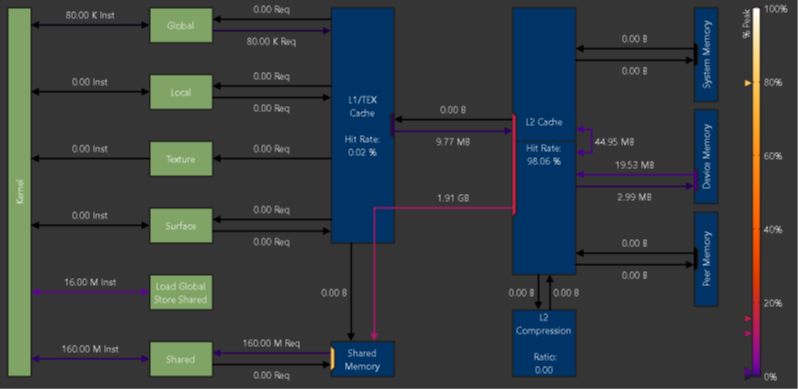
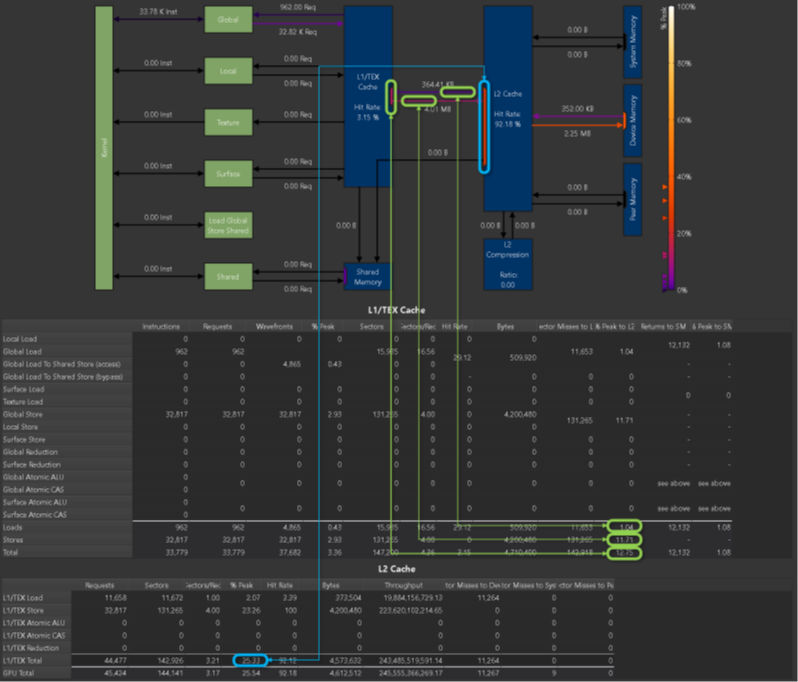

[toc]

---
## 1 Introduction

## 2 Metric Collection
### 2.3 Replay
- **Kerenl Replay**
- **Application Replay**
- **Range Replay**
### 2.4 Profile Series
### 2.5 Overhead
overhead depends on a number of different factors
-   Number and type of collected metrics
-   The collected section set
-   Number of collected sections
-   Number of profiled kernels
-   GPU Architecture

---

## 3 Metrics Guide
### 3.1 hardware model
### 3.2 Metrics structure

- what happened (counters and metrics)
- how close the app reached the peak perf (throughputs as a percentage) *every counter has associated peak rates in the database*

Two types of peak rates are available for every counter: burst and sustained. Burst rate is the maximum rate reportable in a single clock cycle. Sustained rate is the maximum rate achievable over an infinitely long measurement period, for "typical" operations
### 3.3 Metrics Decode
A *wavefront* is the maximum unit that can pass through that pipeline stage per cycle
A wavefront is described as a (work) package that can be processed at once
*wavefront* Unique "work package" generated at the end of the processing stage for requests. All work items of a wavefront are processed in parallel, while work items of different wavefronts are serialized and processed on different cycles. At least one wavefront is generated for each request.
### 3.4 Range and precision
- Asynchronous GPU activity
to reduce the impact of such asynchronous units, consider profiling on a GPU without active display and without other processes that can access the GPU at the time.
- Multi-pass data collection
applicable try to increase the measured workload to allow the GPU to reach a steady state for each launch. Reducing the number of metrics  collected at the same time can also improve precision by increasing the likelihood that counters contributing to one metric are collected in a single pass.

---

## 4 Sampling
At a fixed interval of cycles, the sampler in each streaming multiprocessor selects an active warp and outputs the program counter and the warp scheduler state On small devices, this can be every 32 cycles. On larger chips with more multiprocessors, this may be 2048 cycles
### 4.1 Warp Scheduler States TBD
- **Allocation**: 1. waiting for a branch to resolve 2. Waiting For all memory op to retire 3. waiting to be allocated to the micro-scheduler.
- **Barrier**: waiting for sibling warps at a CTA barrier *(A high number of warps waiting at a barrier is commonly caused by diverging code paths before a barrier)* <u>Whenever possible, try to divide up the work into blocks of uniform workloads. Also, try to identify which barrier instruction causes the most stalls, and optimize the code executed before that synchronization point first. </u>
- **Membar**: waiting on a memory barrier *(Avoid executing any unnecessary memory barriers and assure that any outstanding memory operations are fully optimized for the target architecture.)*
- **Branch resolving**: waiting for a branch target to be computed, and the warp program counter to be updated *(Excessively jumping (branching) can lead to more warps stalled for this reason.)*
- **No instructions** waiting to be selected to fetch an instruction or waiting on an instruction cache miss
- **dispatch** waiting for a dispatch stall
- **drain**: waiting for all memory instructions to complete so that warp resources can be freed
- **IMC miss**:waiting for an immediate constant cache (IMC) miss
- **LG throttle
- **MIO throttle
- **TEX throttle
- **Math Pipe throttle
- **Long scoreboard
- **Short scoreboard
- **Not Selected
- **Selected
- **Sleeping
- **Wait
- **Misc

---

## 5 Reproducibility
provide actionable and deterministic results across application runs, several ways to adjust the metrics collection
### 5.1 serializing kernel launches
without serialization, performance metric values might vary widely if kernel execute concurrently on the same device.
It is currently not possible to disable this tool behavior
### 5.2 adjusting GPU clocks
limit GPU clock frequencies to their base value. As a result, metric values are less impacted by the location of the kernel in the application, or by the number of the specific replay pass
users can adjust the `--clock-control` option to specify if any clock frequencies should be fixed by the tool
### 5.3 purging GPU caches before each kernel replay
Nsight Compute can save and restore the contents of GPU device memory accessed by the kernel for each pass **by default flushes all GPU caches before each replay pass**
users can use `--cache-control none` to disable flushing of any HW cache by the tool.
### 5.4 Persistance Mode
Application start latency is related to GPU initialization status by NVIDIA kernel mode driver:

Applications that trigger GPU initialization may incur a short (order of 1-3 second) startup cost per GPU due to ECC scrubbing behavior. If the GPU is already initialized this scrubbing does not take place

It is recommended to enable persistence mode on applicable operating systems before profiling with NVIDIA Nsight Compute for more consistent application behavior

---
## 6 Special Configuration
### 6.1 Multi-instance GPU

Multi-Instance GPU (MIG) is a feature that allows **a GPU to be partitioned into multiple CUDA devices**. The partitioning is carried out on two levels: **First**, a GPU can be split into one or multiple `GPU Instances`. Each GPU Instance claims ownership of one or more streaming multiprocessors (SM), a subset of the overall GPU memory, and possibly other GPU resources, such as the video encoders/decoders. **Second**, each GPU Instance can be further partitioned into one or more `Compute Instances`. Each Compute Instance has exclusive ownership of its assigned SMs of the GPU Instance. However, all Compute Instances within a GPU Instance share the GPU Instance's memory and memory bandwidth

For profiling, a Compute Instance can be of one of two types: *isolated* or *shared*
**isolate** owns all of its assigned resources and does not share any GPU unit with another Compute Instance In other words, the Compute Instance is the same size as its parent GPU Instance and consequently does not have any other sibling Compute Instances. Profiling works as usual for isolated Compute Instances.

**shared** GPU resources that can potentially also be accessed by other Compute Instances in the same GPU Instance. Due to this resource sharing, collecting profiling data from those shared units is not permitted

---
## 7 Roofline Charts
Kernel performance
Not only: dependent on the operational speed of the GPU
but also: dependent on the rate at which the GPU can feed data to the kernel.

Roofline combines above two factors (peak performance and memory bandwidth)

 
- $ArithmeticIntensity(FLOPB) = works(FLOPS) / memoryTraffic(BPS)$
 

- *vertical axis represents Floating Point Operations per Second (FLOPS) with logarithmic scaled.*
- *Horizontal axis represents Arithmetic Intensity(FLOPS/Byte) with logarithmic scaled*
- *Memory bandwidth boundary*
- *ridge point*

- *Memory Bound Region*
- *Compute Bound Region*
The region in which the achieved value falls, determines the current limiting factor of kernel performance

The distance from the achieved value to the respective roofline boundary (shown in this figure as a dotted white line), represents the **opportunity for performance improvement.**

***case:*** 
An achieved value that lies on the Memory Bandwidth Boundary but is not yet at the height of the ridge point
indicates that any further improvements in overall FLOP/s are only possible if the Arithmetic Intensity is increased at the same time

---
## 8 Memory Charts

While the links sharing a port might operate well below their individual peak performances, the unit's data port may have already reached its peak
Port utilization is shown in the chart by colored rectangles inside the units located at the incoming and outgoing links

---
## 9 Memory Table
### 9.1 Shared Memory
- instructions
- requests
- **wavefronts** : Number of wavefronts required to service the requested shared memory data.  Wavefronts are serialized and processed on different cycles.
- % peak
- bankconflicts

### 9.2 L1/TEX Cache
- instructions
- requests
- wavefronts
- wavefront % peak : Percentage of peak utilization for the units processing wavefronts. High numbers can imply that the processing pipelines are saturated and can become a bottleneck
- **sectors** : Atomics and reductions are passed through to the L2 cache.
- **sectors / req** : The average ratio of sectors to requests for the L1 cache. For the same number of active threads in a warp, ***smaller numbers*** imply a more efficient memory access pattern. (page48) ***Higher numbers*** can imply uncoalesced memory accesses and will result in increased memory traffic.(32-bytes per sector)
- **Hit Rate**
- **Bytes**
- **sector miss to L2**
- **% peak to L2** : Percentage of peak utilization of the L1-to-XBAR interface, Percentage of peak utilization of the L1-to-XBAR interface
- **Returns to SM**: Number of return packets sent from the L1 cache back to the SM.
- **% peak to SM** : Percentage of peak utilization of the XBAR-to-L1 return path (compare Returns to SM).

### 9.3 L2 Cache
- **Requests**
- **Sectors**
- **Sectors / Req**
- **% peak**
- **Hit Rate**
- **Bytes**
- **Throughput** : Achieved L2 cache throughput in bytes per second
- **Sector Misses to Device** : Total number of sectors that miss in L2 and generate subsequent requests in device memory.
- **Sector Misses to system** : Total number of sectors that miss in L2 and generate subsequent requests in system memory
- **Sector Misses to Peer** : Total number of sectors that miss in L2 and generate subsequent requests in peer memory

### 9.4 L2 Cache Eviction Policies
- **First**: Number of sectors accessed in the L2 cache using the evict_first policy
- **Hit rate**: Cache hit rate for sector accesses in the L2 cache using the evict_first policy.
- **Last**:
- **Hit Rate**:
- **Normal**: Number of sectors accessed in the L2 cache using the evict_normal policy.  (default policy)
- **Hit Rate**
- **Normal Demote** Number of sectors accessed in the L2 cache using the evict_normal_demote policy
- **Hit Rate**

### 9.5 device Memory
- **Sectors**
- **% peak**
- **Bytes**
- **Throughput**

---
## FAQ
