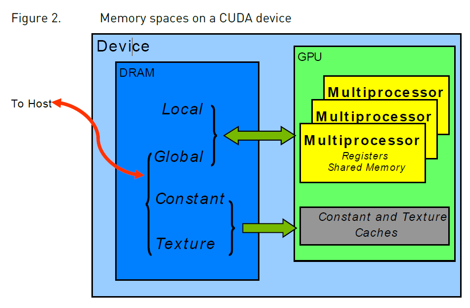
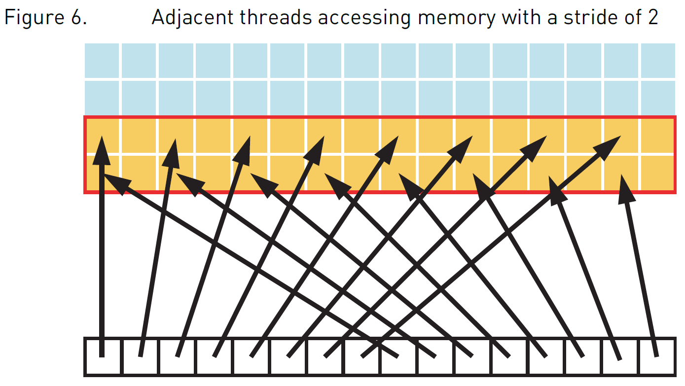
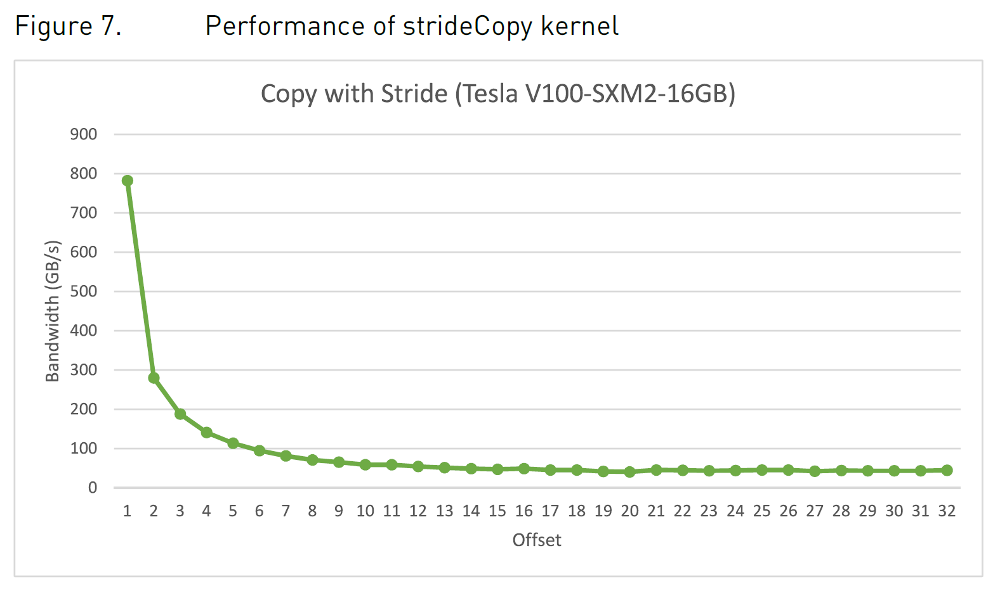
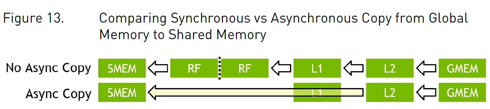
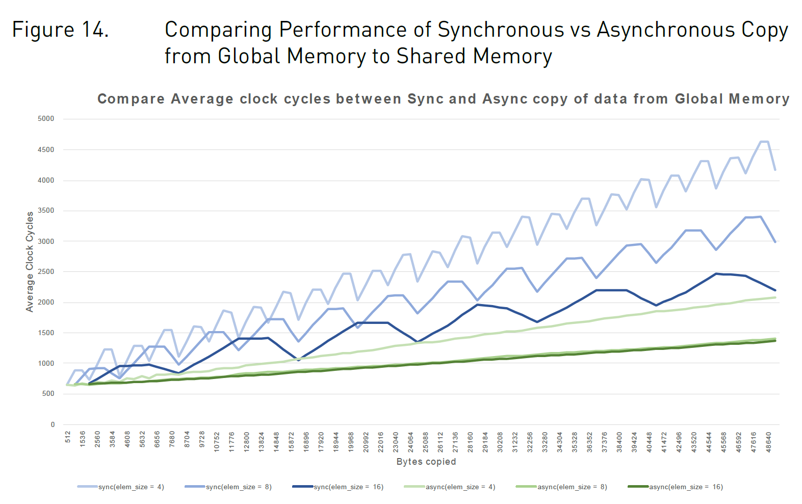

# CUDA C Best Practices Guide
[toc]
---
## 1. Accessing your application
---
## 2. Heterogeneous Computing
difference between Host and Device:
1. Threading resources (threads amount)
2. Threads thread context switch penalty  
   host: minimize latency  
   device: maximize throughput
3. RAM

### 2.1 What parts of application to run on device
1. a large number of operations can be processed in parallel.
2. Data values need to be transferred from host to device
   1. The complexity of operations should justify the cost of moving data to and from the deviceCode that transfers data for brief use by a small number of threads will see little or no performance benefit, The ideal scenario is one in which many threads perform a substantial amount of work  (it is important to include the overhead of transferring data to and from the device in determining whether operations should be performed on the host or on the device.)
    2. Data should be kept on the device as long as possible.
    3. For best performance, there should be some coherence in memory access by adjacent threads running on the device  (Certain memory access patterns enable the hardware to coalesce groups of reads or writes of multiple data items into one operation. Data that cannot be laid out so as to enable coalescing)  
***A noteworthy exception to this are completely random memory access patterns. In general, they should be avoided, because compared to peak capabilities any architecture processes these memory access patterns at a low efficiency. However, compared to cache based architectures, like CPUs, latency hiding architectures, like GPUs, tend to cope better with completely random memory access patterns***

---

## 3. APP Profiling
1. The most important consideration with any profiling activity is to ensure that the workload is realistic   
   ***gprof， an opensource linux based profiling tool***  
2. identify hotspot (who(function call) costs the most of app execution time)
3. Understand Scaling  
   Code that cannot be sufficiently parallelized should run on the host, unless doing so would result in excessive transfers between the host and the device.  
   <br>
  - **Strong Scaling and Amdahl's Law** (Gene Myron Amdahl) 
   Strong scaling is a measure of how, for a fixed overall problem size, the time to solution decreases as more processors are added to a system. ***Strong scaling is usually equated with Amdahl's Law***
<center>maximum speedup `S = 1/((1-P)+P/N)`</center> 

   **Here P is the fraction of the total serial execution time taken by the portion of code that can be parallelized**
   **and N is the number of processors over which the parallel portion of the code runs.**
   It can be simpler to view N as a very large number, which essentially transforms the equation
into `S = 1/(1-P)`. Now, if 3/4 of the running time of a sequential program is parallelized, the
maximum speedup over serial code is 1 / (1 - 3/4) = 4.   
   *it is worthwhile to spend effort on increasing P*  
   <br>
  - **Weak Scaling and Gustafson's Law**  
    Weak scaling is a measure of how the time to solution changes as more processors are
added to a system with a fixed problem size **per processor**, Weak scaling is often equated with Gustafson's Law, which states that in practice, the problem size scales with the number of processors. 
<center>maximum speedup `S = N +(1-P)(1-N)`</center>

***Another way of looking at Gustafson's Law is that it is not the problem size that remains constant as we scale up the system but rather the execution time.***
Gustafson's Law assumes that the ratio of serial to parallel execution remains constant, reflecting additional cost in setting up and handling the larger problem.  
<u>
  - **Choose which law to use**  
For some applications the problem size will remain constant and hence only strong scaling is applicable  
For other applications, the problem size will grow to fill the available processors use Weak scaling..
</u>  

***

## 5. Getting started
1. use libs "cuBLAS","cuFFT","Thrust" 
2. use parallel compiler "openAcc"
3. coding to expose parallelism "CUDA C++"

***

## 6. Getting the right answer
examines issues that can affect the correctness of returned data and points to appropriate solutions
1. reference comparing
2. unit test (break kernel down in several pieces for easy verify)
3. Numerical Accuracy and Precision
***

## 7.Optimize CUDA APP
Optimizations can be applied at various levels, from overlapping data transfers with computation all the way down to fine-tuning floating-point operation sequences

***

## 8. Performance Matrics
how bandwidth affects performance metrics and how to mitigate some of the challenges it poses.  

### 8.1 Timing  
- CPU Timer:  
   When using CPU timers, it is critical to remember that many CUDA API functions are asynchronous
   - kerenl launch
   - memory copy with `Async` suffix  

      - *cudaDeviceSynchronize() to immediately before starting and stopping the CPU timer to synchronize CPU thread with GPU cudaDeviceSynchronize() blocks the calling CPU thread until all CUDA calls previously issued by the thread are completed*  
      - *cudaStreamSynchronize()*  
      - *cudaEventSynchronize()*  

    Be aware that CPU-to-GPU synchronization points such as those mentioned in this section imply a stall in the GPU's processing pipeline and should thus be used sparingly to minimize their performance impact 

   <br>
- CUDA GPU Timer:  
    API provides calls that create and destroy events, record events (including a timestamp), and convert timestamp differences into a floating-point value in milliseconds  

    ```cpp
      cudaEvent_t start, stop;
      float time;
      cudaEventCreate(&start);
      cudaEventCreate(&stop);
      cudaEventRecord( start, 0 );
      kernel<<<grid,threads>>> ( d_odata, d_idata, size_x, size_y, NUM_REPS);
      cudaEventRecord( stop, 0 );
      cudaEventSynchronize( stop );
      cudaEventElapsedTime( &time, start, stop );
      cudaEventDestroy( start );
      cudaEventDestroy( stop );
    ```

### 8.2 Bandwidth  
Bandwidth - the rate at which data can be transferred - is one of the most important gating factors for performance bandwidth can be dramatically affected by
   - the choice of memory in which data is stored, 
   - how the data is laid out 
   - the order in which it is accessed, 
   - as well as other factors.

   To measure performance accurately, it is useful to calculate theoretical and effective bandwidth
  - **Theoretical bandwidth calculation**    
> the NVIDIA Tesla V100 uses HBM2 (double data rate) RAM with a memory clock rate of 877 MHz and a 4096-bit-wide memory interface. Using these data items, the peak theoretical memory bandwidth of the NVIDIA Tesla V100 is 898 GB/s

$(0.877 * 10^9 * (4096 / 8) * 2) * 10^9 = 898 GB/s$

> In this calculation, the memory clock rate is converted in to Hz, multiplied by the interface width (divided by 8, to convert bits to bytes) and multiplied by 2 due to the double data rate. Finally, this product is divided by 109 to convert the result to GB/s.

   **Note:** Some calculations use 1024^3 instead of 10^9 for the final calculation. In such a case, the bandwidth would be `836.4 GiB/s`. It is important to use the same divisor when calculating theoretical and effective bandwidth so that the comparison is valid.
   - **effective bandwidth calculation**
   Effective bandwidth is calculated by timing specific program activities and by knowing how data is accessed by the program. To do so, use this equation:

   $effectiveBandwidth = ((BytesRead + BytesWrite)/10^9)/time(s)$            

   Here, the effective bandwidth is in units of GB/s, Br is the number of bytes read per kernel, Bw is the number of bytes written per kernel, and time is given in seconds

### 8.3 Reports
- Requested Global Load Throughput *(effective bandwidth)*
- Requested Global Store Throughput
- Global Load Throughput *(actual throughput that loaded including which may not used by kernel due to the minimum transaction size is larger than the actual data kernel needed)*
- Global Store Throughput
- DRAM Read Throughput
- DRAM Write Throughput
<br>
* The actual memory throughput shows how close the code is to the hardware limit, 
* A comparison of the effective or requested bandwidth to the actual bandwidth presents a good estimate of how much bandwidth is wasted by suboptimal coalescing of memory accesses 
* For global memory accesses, this comparison of requested memory bandwidth to actual memory bandwidth is reported by the `Global Memory Load Efficiency` and `Global Memory Store Efficiency` metrics

***

## 9. Memory Optimization
Goal: maximize the use of the hardware by maximizing bandwidth. Bandwidth is best served by using as much fast memory and as little slow-access memory as possible.   

### 9.1 Data Transfer between host and device
>NVIDIA TESLA V100 peak theoretical bandwidth between Device memory and GPU 898GB/s peak theoretical bandwidth between host memory and device memory 16GB/s (PCIe Gen3 x16)

- minimize data transfer between Host memory and device memory
- Intermediate data structures should be created in device memory
- batching many small transfers into one larger transfer performs significantly better than making each transfer separately,
- higher bandwidth between the host and the device is achieved when using **page-locked (or pinned) memory**
   - *Pinned memory is allocated using the `cudaHostAlloc()`* (CUDA Sample: `bandwidthTest`)
   - `cudaHostRegister()`
   - *Pinned memory should not be overused.(scarce resource)*
   - the pinning of system memory is a heavyweight operation compared to most normal system memory allocations
   <br>
- **Asynchronous and Overlapping Transfers with Computation**
   - `cudaMemcpy()` blocking transfer
   - `cudaMemcpyAsync()` non-blocking transfer *the asynchronous transfer version requires pinned host memory (see Pinned Memory), and it contains an additional argument, a stream ID,* **stream** is simply a sequence of operations that are performed in order on the device Operations in different streams can be interleaved and in some cases overlapped - a property that can be used to hide data transfers between the host and the device.
   ***Asynchronous transfers enable overlap of data transfers with computation in two different
ways.*** 
   1. overlap host computation with asynchronous data transfers 
   2. and with device computations

   ```cpp
   //[overlapping computation and data transfers]
   cudaMemcpyAsync(a_d, a_h, size, cudaMemcpyHostToDevice, 0);  // last arg: streamID, "0" default stream
   kernel<<<grid, block>>>(a_d);  // also use the default stream.
   cpuFunction();
   ```

   ```cpp
   //[concurrent copy and execute]
   cudaStreamCreate(&stream1);
   cudaStreamCreate(&stream2);
   cudaMemcpyAsync(a_d, a_h, size, cudaMemcpyHostToDevice, stream1);
   kernel<<<grid, block, 0, stream2>>>(otherData_d);
   ```

   ```cpp
   //[Sequential copy and execute]
   cudaMemcpy(a_d, a_h, N*sizeof(float), dir);
   kernel<<<N/nThreads, nThreads>>>(a_d);
   ```

   ```cpp
   //[staged concurrent copy and execute]
   size=N*sizeof(float)/nStreams;  
   for (i=0; i<nStreams; i++) {
      offset = i*N/nStreams;
      cudaMemcpyAsync(a_d+offset, a_h+offset, size, dir, stream[i]);
      kernel<<<N/(nThreads*nStreams), nThreads, 0, stream[i]>>>(a_d+offset);
   }
   // Note:N is evenly divisible by nThreads*nStreams
   ```
   **Note:** It should be mentioned that it is not possible to overlap a blocking transfer with an asynchronous transfer, because the blocking transfer occurs in the default stream, so it will not begin until all previous CUDA calls complete. It will not allow any other CUDA call to begin until it has completed.
   <br>
- **Zero Copy**
   It enables GPU threads to directly access host memory

   ```cpp
   float *a_h, *a_map;
   ...
   cudaGetDeviceProperties(&prop, 0);
   if (!prop.canMapHostMemory)
      exit(0);
   cudaSetDeviceFlags(cudaDeviceMapHost);
   cudaHostAlloc(&a_h, nBytes, cudaHostAllocMapped);
   cudaHostGetDevicePointer(&a_map, a_h, 0);
   kernel<<<gridSize, blockSize>>>(a_map);
   ```

   **Note:** Mapped pinned host memory allows you to overlap CPU-GPU memory transfers with computation while avoiding the use of CUDA streams. But since any repeated access to such memory areas causes repeated CPU-GPU transfers, consider creating a second area in device memory to manually cache the previously read host memory data.*

   <br>
- **Unified Virtual Addressing**
   With UVA, the host memory and the device memories of all installed supported devices share a single virtual address space.
   <br>

### 9.2 Device Memory Space


|Memory|Location|Cached|Access|Scope|LifeTime|
|:-----|:-------|:-----|:-----|:----|:-------|
|Register|OnChip|n/a|r/w|1thread|thread|
|Local|OffChip|Yes|r/w|1thread|Thread|
|Shared|OnChip|n/a|r/w|all threads in block|block|
|Global|OffChip|Yes|r/w|All threads + host|Host allocation|
|Constant|OffChip|Yes|ro|All threads + host|Host allocation|
|Texture|OffChip|Yes|ro|All threads + host|Host allocation|

**Note:** In the case of texture access, if a texture reference is bound to a linear array in global memory, then the device code can write to the underlying array Texture references that are bound to CUDA arrays can be written to via surface-write operations by binding a surface to the same underlying CUDA array storage). Reading from a texture while writing to its underlying global memory array in the same kernel launch should be avoided*

---

- **Coalesced Access to global memory**
Global memory loads and stores by threads of a warp are coalesced by the device into as few as possible transactions
**Note: Ensure global memory accesses are coalesced whenever possible.**
    Access requirements for coalescing: 
    1. the concurrent accesses of the threads of a warp will coalesce into a number of transactions equal to the number of 32-byte transactions necessary to service all of the threads of the warp
    2. Scattered accesses increase ECC memory transfer overhead, especially when writing data to global memory. So accessing memory in a coalesced way is even more import in GDDR system when ECC turned on.

   - simple access pattern:

   - a sequential but misaligned access pattern  
    If sequential threads in a warp access memory that is sequential but not aligned with a 32-byte segment, five 32-byte segments will be requested cudaMalloc(), is guaranteed to be aligned to at least 256 bytes choosing sensible thread block sizes, such as multiples of the warp size (i.e., 32 on current GPUs), facilitates memory accesses by warps that are properly aligned.

   - Effects of Misaligned Accesses
    ```cpp
    __global__ void offsetCopy(float *odata, float* idata, int offset)
   {
      int xid = blockIdx.x * blockDim.x + threadIdx.x + offset;
      odata[xid] = idata[xid];
   }
   // Note: The kernel is executed within a loop in host code that varies the parameter offset from 0 to 32, which causes misalign
    ```

   - Strided Accesses
   ```cpp
   __global__ void strideCopy(float *odata, float* idata, int stride)
   {
      int xid = (blockIdx.x*blockDim.x + threadIdx.x)*stride;
      odata[xid] = idata[xid];
   }
   // Note: non-unit-stride global memory accesses should be avoided whenever possible
   ```

   
   

---

- **L2 CACHE**
   CUDA11 or compute capability 8.0 and above have the capability to  **influence persistence** of data in the L2 cache.
   **Persisting**: When a CUDA kernel accesses a data region in the global memory repeatedly, such data accesses can be considered to be persisting  
   **streaming**: if the data is only accessed once, such data accesses can be considered to be streaming
   - L2 ACCESS WINDOW

   ```cpp
   cudaGetDeviceProperties(&prop, device_id);
   cudaDeviceSetLimit(cudaLimitPersistingL2CacheSize, prop.persistingL2CacheMaxSize); /* Set aside max possible size of L2 cache for persisting accesses */
   ```
   ***Mapping user data to L2 set-aside portion*** can be controlled using an access **<font color=#FF0000> policy window </font>**
   ```cpp
   cudaStreamAttrValue stream_attribute;                                        // Stream level attributes data structure
   stream_attribute.accessPolicyWindow.base_ptr = reinterpret_cast<void*>(ptr); // Global Memory data pointer
   stream_attribute.accessPolicyWindow.num_bytes = num_bytes; // Number of bytes for persisting accesses. (Must be less than cudaDeviceProp::accessPolicyMaxWindowSize)  
   stream_attribute.accessPolicyWindow.hitRatio = 1.0;        // Hint for L2 cache hit ratio for persisting accesses in the num_bytes region
   stream_attribute.accessPolicyWindow.hitProp = cudaAccessPropertyPersisting; // Type of access property on cache hit
   stream_attribute.accessPolicyWindow.missProp = cudaAccessPropertyStreaming; // Type of access property on cache miss.
                                                                               // Set the attributes to a CUDA stream of type cudaStream_t
   cudaStreamSetAttribute(stream, cudaStreamAttributeAccessPolicyWindow, &stream_attribute);
   // Note: The access policy window requires a value for hitRatio and num_bytes. Depending on the value of the num_bytes parameter and the size of L2 cache, one may need to tune the value of hitRatio to avoid thrashing of L2 cache lines
   ```

   - TUNING THE ACCESS WINDOW HIT-RATIO 
   **<font color=#00AE00>TBD</font>**

---
- **SHARED MEMORY**
   1. on-chip  
   2. high-bandwidth
   3. low-latnecy
   4. no-bank conflicts
   5. compute capability newer than 5.x : 32 x 32-bit width banks. 
      compute capability 3.x            : 32 x 64-bit width banks.
   - ***shared memory for matrix multiplication $C=AB$*** 
   1. Shared memory enables cooperation between threads in a block(CTA)
   2. When multiple threads in a block use the same data from global memory, shared memory can be used to access the data from global memory only   once.   
   3. Shared memory can also be used to avoid uncoalesced memory accesses by loading and storing data in a coalesced pattern from global memory and then reordering it in shared  memory.

   ```cpp
   // A natural decomposition of the problem is to use a block(CTA) and tile size of kxk threads.
   __global__ void simpleMultiply(float *a, float* b, float *c, int N) // Unoptimized matrix multiplication
   {
      int row = blockIdx.y * blockDim.y + threadIdx.y;
      int col = blockIdx.x * blockDim.x + threadIdx.x;
      float sum = 0.0f;
      for (int i = 0; i < TILE_DIM; i++) { // The for loop over i multiplies a row of A by a column of B, which is then written to C
         sum += a[row*TILE_DIM+i] * b[i*N+col];
      }
      c[row*N+col] = sum; //Computing a row of a tile in C using one row of A and an entire tile of B
   }
   // Note: blockDim.x, blockDim.y, and TILE_DIM are all equal to k. A= k*M; B= N*k
   ```  
   ***Notes:***
   *For each iteration i of the for loop, the threads in a warp read a row of the B tile, which is a sequential and coalesced access for all compute capabilities. For each iteration i, **all threads in a warp read the same value from global memory for matrix A**, as the index  `row*TILE_DIM+i` is constant within a warp*
   ***Disadvantage:*** 
   when many warps execute on the same multiprocessor simultaneously, as is generally the case, the cache line may easily be evicted from the cache between iterations i and i+1.

   ```cpp
   __global__ void coalescedMultiply(float *a, float* b, float *c, int N) //Using shared memory to improve the global memory load efficiency in matrix multiplication
   {
      __shared__ float aTile[TILE_DIM][TILE_DIM];
      int row = blockIdx.y * blockDim.y + threadIdx.y;
      int col = blockIdx.x * blockDim.x + threadIdx.x;
      float sum = 0.0f;
      aTile[threadIdx.y][threadIdx.x] = a[row*TILE_DIM+threadIdx.x];
      __syncwarp();
      for (int i = 0; i < TILE_DIM; i++) {
         sum += aTile[threadIdx.y][i]* b[i*N+col];
      }
      c[row*N+col] = sum;
   }
   ```
   ***Notes:***
   *Within each iteration of the for loop, a value in shared memory is broadcast to all threads in a warp*
   *Instead of a `__syncthreads()` synchronization barrier call, a `__syncwarp()` is sufficient after reading the tile of A into shared memory because only threads within the warp that write the data into shared memory read this data.*
   
   
   ```cpp
   __global__ void sharedABMultiply(float *a, float* b, float *c, int N) //Improvement by reading additional data into shared memory
   {
      __shared__ float aTile[TILE_DIM][TILE_DIM],
                       bTile[TILE_DIM][TILE_DIM];
      int row = blockIdx.y * blockDim.y + threadIdx.y;
      int col = blockIdx.x * blockDim.x + threadIdx.x;
      float sum = 0.0f;
      aTile[threadIdx.y][threadIdx.x] = a[row*TILE_DIM+threadIdx.x];
      bTile[threadIdx.y][threadIdx.x] = b[threadIdx.y*N+col];
      __syncthreads();
      for (int i = 0; i < TILE_DIM; i++) {
         sum += aTile[threadIdx.y][i]* bTile[i][threadIdx.x];
      }
      c[row*N+col] = sum;
   }
   ```
   ***Notes:***
   *a __syncthreads() call is required after reading the B tile because a warp reads data from shared memory that were written to shared memory by different warps*
   
   * * *
   - ***shared memory for matrix multiplication $C=A(AT)$*** 
   ```cpp
   __global__ void simpleMultiply(float *a, float *c, int M) //Unoptimized handling of strided accesses to global memory
   {
      int row = blockIdx.y * blockDim.y + threadIdx.y;
      int col = blockIdx.x * blockDim.x + threadIdx.x;
      float sum = 0.0f;
      for (int i = 0; i < TILE_DIM; i++) {
         sum += a[row*TILE_DIM+i] * a[col*TILE_DIM+i];// a index  direction is row; a-t is col
      }
      c[row*M+col] = sum;
   }
   ```
   ***Notes/Disadvantages:***
   1. a[`col*TILE_DIM+i`], for each iteration i. For a warp of threads, col represents sequential columns of the transpose of A, and therefore `col*TILE_DIM` represents a strided access of global memory with a stride of K, resulting in plenty of wasted bandwidth.
   <br>

   ```cpp
   __global__ void coalescedMultiply(float *a, float *c, int M) //An optimized handling of strided accesses using coalesced reads from global memory
   {  
      __shared__ float aTile[TILE_DIM][TILE_DIM],
                       transposedTile[TILE_DIM][TILE_DIM];
      // to reduce bank conflicts:
      // __shared__ float transposedTile[TILE_DIM][TILE_DIM+1]; // to pad the shared memory array so that it has an extra column,
      int row = blockIdx.y * blockDim.y + threadIdx.y;
      int col = blockIdx.x * blockDim.x + threadIdx.x;
      float sum = 0.0f;
      aTile[threadIdx.y][threadIdx.x] = a[row*TILE_DIM+threadIdx.x];
      transposedTile[threadIdx.x][threadIdx.y] = a[(blockIdx.x*blockDim.x + threadIdx.y)*TILE_DIM + threadIdx.x];
      __syncthreads();
      for (int i = 0; i < TILE_DIM; i++) {
         sum += aTile[threadIdx.y][i]* transposedTile[i][threadIdx.x];
      }
      c[row*M+col] = sum;
   }
   ````
   ***Notes:***
      1. To enable coalesced accesses to global memory, especially to avoid large strides (for general matrices, strides are much larger than 32) 
      2. To eliminate (or reduce) redundant loads from global memory 
      3. To avoid wasted bandwidth***
   * * *
   - Asynchronous Copy from Global Memory to Shared Memory (LDGSTS)
   CUDA11.0
   Using asynchronous copies does not use any intermediate register. Not using intermediate registers can help reduce register pressure and can increase kernel occupancy.
   
   
   ***1. Best performance with synchronous copy is achieved when the copy_count parameter is a multiple of 4 for all three element sizes. The compiler can optimize groups of 4 load and store instructions. This is evident from the saw tooth curves.
      2. Asynchronous copy achieves better performance in nearly all cases.
      3. The async-copy does not require the copy_count parameter to be a multiple of 4, to maximize performance through compiler optimizations.
      4. Overall, best performance is achieved when using asynchronous copies with an element of size 8 or 16 bytes.***
---
- **Local Memory**
   1. local to the thread,
   2. In fact, local memory is off-chip. Hence, access to local memory is as expensive as access to global memory
   3. Local memory is used only to hold automatic variables, done by the nvcc compiler, if compiler find the variable consumes too much register space for the targeted architecture.
   4. compiler reports total local memory usage per kernel **(lmem)** when run with the `--ptxas-options=-v` option.
---
- **Texture Memory**
   1. cached
   2. The texture cache is optimized for 2D spatial locality, so threads of the same warp that read texture addresses that are close together will achieve best performanceThe texture cache is optimized for 2D spatial locality
   3. Texture memory is also designed for streaming fetches with a constant latency
   4. ***In certain addressing situations, reading device memory through texture fetching can be an advantageous alternative to reading device memory from global or constant memory.***   
   5. If textures are fetched using tex1D(), tex2D(), or tex3D() rather than tex1Dfetch(), the hardware provides other capabilities that might be useful for some  applications such as image processing,    


   **<center>Useful Features for tex1D(), tex2D(), and tex3D() Fetches</center>**

   |Feature|Use|Caveat|
   |:---|:---|:---|:---|
   |Filtering|fast, low-precision interpolation between texels|valid only if the texture reference returns floating-point data|
   |Normalized texture coordinate|Resolution-independent coding|None|
   |Addressing modes|Automatic handling of boundary cases|Can be used only with normalized texture coordinates|
   |Automatic handling of boundary cases: refers to how a texture coordinate is resolved when it falls outside the valid addressing range. refers to how a texture coordinate is resolved when it falls outside the valid addressing range. There are two options: `clamp` and `wrap`.|

   **<font color=#FF0000>the texture cache is not kept coherent with respect to global memory writes</font>**
---

- **Constant Memory**
   1. total of 64 KB constant memory on a device
   2. cached
   3. Accesses to different addresses by threads within a warp are serialized,
   4. If all threads of a warp access the same location, then constant memory can be as fast as a register access.
---
- **Regsters**
   1. delays may occur due to register RAW dependencies and register memory bank conflicts
   2. compiler and hardware thread scheduler schedule instructions as optimally as possible to avoid register memory bank conflicts
   3. partitioned among concurrent threads
   4. Control maximum number of regsters to allocated per thread:
      a. use the `-maxrregcount=N` compiler command-line option
      b. the launch bounds kernel definition qualifier   


### 9.3 Allocation
Device memory allocation and de-allocation via `cudaMalloc()` and `cudaFree()` are expensive operations, so device memory should be reused and/or sub-allocated by the application wherever possible to minimize the impact of allocations on overall performance

### 9.4 NUMA Best Practices
   **<font color=#008800>TBD</font>**

---
## 10. Execution Configuration Optimization
   Occupancy
   concurrent kernel execution.
   the management of system resources allocated for a particular task.
### 10.1 Occupancy
   - **Occupancy**: related to the number of active warps on a multiprocessor is therefore important in determining how effectively the hardware is kept busy, Occupancy is the ratio of the number of active warps per multiprocessor to the maximum number of possible active warps. Another way to view occupancy is the percentage of the hardware's ability to process warps that is actively in use.
   BUT: **Higher occupancy does not always equate to higher performance**

      `__launch_bounds__(maxThreadsPerBlock)` which specifies the largest block size that the kernel will be launched with.  

      `__launch_bounds__(maxThreadsPerBlock,minBlocksPerMultiprocessor)` can improve perf in some cases, The right value for `minBlocksPerMultiprocessor` should be determined using a detailed per kernel analysis
   <br>

   - **Calculating Occupancy**
   register availability
   >on devices of compute capability 7.0 each multiprocessor has 65536 32-bit registers and can have a maximum of 2048 simultaneous threads resident (64 warps x 32 threads per warp). --- each thread can use at most 32 registers

   >For example, on a device of compute capability 7.0, a kernel with 128-thread blocks using 37 registers per thread results in an occupancy of 75% with 12 active 128-thread blocks per multi-processor, whereas a kernel with 320-thread blocks using the same 37 registers per thread results in an occupancy of 63% because only four 320-thread blocks can reside on a multiprocessor. Furthermore, register allocations are rounded up to the nearest 256 registers per block on devices with compute capability 7.0.

   *<font color=#008800>
    register allocation granularity: warp
    register allocation unit size: 256
    max warps per multiprocessor: 64
    in example above: 128threads per block -> 4warps per block. per thread 37 register -> 37x32=1184 registers per warp, align to 256 = 1280 regsters per warp. x4 to 5120 registers per block, 65536/5120=12.8, so maximum 12 blocks in flight. total 48 warps in flight. 48/64 = 75% </font>*

   **<font color=#FF0000>TBD</font>**

   [CUDA Occupancy Calculator](./CUDA_Occupancy_Calculator.xls)
   
   CUDA Runtime API : `cudaOccupancyMaxActiveBlocksPerMultiprocessor`

### 10.2 Hiding register dependencies
   The latency of most arithmetic instructions is typically 4 cycles on devices of compute capability 7.0.

### 10.3 Thread and Block Heuristics
> **The number of threads per block should be a multiple of 32 threads, because this provides optimal computing efficiency and facilitates coalescing**
The dimension and size of blocks per grid and the dimension and size of threads per block are both important factors The multidimensional aspect of these parameters allows easier mapping of multidimensional problems to CUDA and does not play a role in performance - So we focus on size not dimension

- **grid size** (number of blocks per grid)
   - ***The number of blocks in a grid should be larger than the number of multiprocessors so that all multiprocessors have at least one block to execute.***
   - ***there should be multiple active blocks per multiprocessor so that blocks that aren't waiting for a `__syncthreads()` can keep the hardware busy*** (This recommendation is subject to resource availability, therefore, it should be determined by **block size**, as well as shared memory usage)
- **block size** (number of threads per block)
When choosing the block size, it is important to remember that multiple concurrent blocks can reside on a multiprocessor, so occupancy is not determined by block size alone. In particular, a larger block size does not imply a higher occupancy. higher occupancy does not always equate to better performance.
   block size selecting rules:
   - ***Threads per block should be a multiple of warp size to avoid wasting computation on under-populated warps and to facilitate coalescing.***
   - ***A minimum of 64 threads per block should be used, and only if there are multiple concurrent blocks per multiprocessor.***
   - ***Between 128 and 256 threads per block is a good initial range for experimentation with different block sizes.***
   - ***Use several smaller thread blocks rather than one large thread block per multiprocessor if latency affects performance. This is particularly beneficial to kernels that frequently call `__syncthreads()`.***

### 10.4 Effects of shared memory
In many cases, the amount of shared memory required by a kernel is related to the block size that was chosen,
The approach of using a single thread to process multiple elements of a shared memory array can be beneficial even if limits such as threads per block are not an issue

### 10.5 Concurrent Kernel Execution
On devices that are capable of concurrent kernel execution, streams can also be used to execute multiple kernels simultaneously to more fully take advantage of the device's multiprocessors
`cudaDeviceProp::concurrentKernels` or `deviceQuery`
Non-default streams are required for concurrent execution because kernel calls that use the default stream begin only after all preceding calls on the device
```cpp
cudaStreamCreate(&stream1);
cudaStreamCreate(&stream2);
kernel1<<<grid, block, 0, stream1>>>(data_1);
kernel2<<<grid, block, 0, stream2>>>(data_2);
```

### 10.6 Multiple contexts
CUDA work occurs within a process space for a particular GPU known as a context. The context encapsulates kernel launches and memory allocations for that GPU as well as supporting constructs such as the page tables.
a CUDA application process can potentially create more than one context for a given GPU.
While multiple contexts can be allocated concurrently on a given GPU, only one of these contexts can execute work
at any given moment on that GPU; contexts sharing the same GPU are time-sliced

creating additional contexts incurs: 
   -  memory overhead for per-context data
   -  time overhead for context switching
   -  the need for context switching can reduce utilization when work from several contexts could otherwise execute concurrently

***it is best to avoid multiple contexts per GPU within the same CUDA application*** To assist with this, the CUDA Driver API provides methods to access and manage a special context on each GPU called the primary context. These are the same contexts used implicitly by the CUDA Runtime when there is not already a current context for a thread.
```cpp
// When initializing the program/library
CUcontext ctx;
cuDevicePrimaryCtxRetain(&ctx, dev);
// When the program/library launches work
cuCtxPushCurrent(ctx);
kernel<<<...>>>(...);
cuCtxPopCurrent(&ctx);
// When the program/library is finished with the context
cuDevicePrimaryCtxRelease(dev);
```
---
## 11. Instruction Optimization
- after all higher-level optimizations have been completed.
### 11.1 Arithmetic Instruction
- Single-precision floats provide the best performance, and their use is highly encouraged.
- Use shift operations to avoid expensive division and modulo calculations.
- Use signed integers rather than unsigned integers as loop counters
- The reciprocal square root should always be invoked explicitly as rsqrtf() for single precision and rsqrt() for double precision.
- Avoid automatic conversion of doubles to floats.
   -  Functions operating on char or short whose operands generally need to be converted to an int
   -  Double-precision floating-point constants (defined without any type suffix) used as input to single-precision floating-point computations(can be avoided by using single-precision floating-point constants, defined with an f suffix such as 3.141592653589793f, 1.0f.) 
-  CUDA math library's complementary error function, `erfcf()`, is particularly fast with full single-precision accuracy
- For some fractional exponents, exponentiation can be accelerated significantly compared to the use of `pow()` by using square roots, cube roots, and their inverses.
-  Use the fast math library whenever speed trumps precision. `__functionName()` They are faster but provide somewhat lower accuracy. `functionName()` are slower but have higher accuracy (more expensive)
- By default, the nvcc compiler generates IEEE-compliant code, but it also provides options to generate code that somewhat less accurate but faster :
   - `-ftz=true` (denormalized numbers are flushed to zero) 
   - `-prec-div=false` (less precise division) 
   - `-prec-sqrt=false` (less precise square root)
   - `-use_fast_math` (aggressive coerces every `functionName()` call to equivalent `__functionName()`)

### 11.2 Memory Instruction
Minimize the use of global memory. Prefer shared memory access where possible


---
## 12. Control Flow
### 12.1 Branching and Divergence
**Note:** Avoid different execution paths within the same warp
Flow control instructions causing threads of the same warp to diverge **increases the total number of instructions executed for this warp** To obtain best performance in cases where the control flow depends on the thread ID, the controlling condition should be written so as to minimize the number of divergent warps.

**For branches including just a few instructions, warp divergence generally results in marginal performance losses.the compiler may use predication to avoid an actual branch** all instructions are scheduled, but a per-thread condition code or predicate controls which threads execute the instructions. Threads with a false predicate do not write results, and also do not evaluate addresses or read operands
> Starting with the Volta architecture, Independent Thread Scheduling allows *a warp to remain diverged outside of the data-dependent conditional block*. An explicit `__syncwarp()` can be used to guarantee that the warp has reconverged for subsequent instructions.


### 12.2 Branch predication
Make it easy for the compiler to use branch predication in lieu of loops or control statements.
Sometimes, the compiler may unroll loops or optimize out if or switch statements by using branch predication instead. In these cases, no warp can ever diverge. The programmer can also control loop unrolling using `#pragma unroll`

When using branch predication, none of the instructions whose execution depends on the controlling condition is skipped. Instead, each such instruction is associated with a per-thread condition code or predicate that is set to true or false according to the controlling condition.  Although each of these instructions is scheduled for execution, only the instructions with a true predicate are actually executed. Instructions with a false predicate do not write results, and they also do not evaluate addresses or read operands.

---

## 13 Deploying CUDA Applications
## 14 Understanding the Programming Environment
## 15 CUDA Compatibility Developer's Guide
## 16 Preparing for Deployment
## 17 Deployment Infrastructure Tools
---
## AppendixA Recommendations and Best Practices
Performance optimization revolves around three basic strategies:
- **Maximizing parallel execution to achieve maximum utilization**
   - structuring the algorithm in a way that exposes as much parallelism as possible.
   - to be mapped to the hardware as efficiently as possible.
   - maximize parallel execution at a higher level by explicitly exposing concurrent execution on the device through streams,
   - maximizing concurrent execution between the host and the device.
<br>

- Optimizing memory usage to achieve maximum memory throughput
   - minimizing data transfers between the host and the device
   - Kernel access to global memory also should be minimized by maximizing the use of shared memory on the device
   - Sometimes, the best optimization might even be to avoid any data transfer in the first place by simply recomputing the data whenever it is needed
   - to organize memory accesses according to the optimal memory access patterns
      -  especially important for global memory accesses due to its high latency
      -  for shared memory access when there exists a high degree of bank conflicts.
<br>

- Optimizing instruction usage to achieve maximum instruction throughput
   - the use of arithmetic instructions that have low throughput should be avoided.
   - This suggests trading precision for speed when it does not affect the end result,
   - particular attention must be paid to control flow instructions due to the SIMT nature of the device.

## AppendixB nvcc Compiler Switches
The NVIDIA nvcc compiler driver converts .cu files into C++ for the host system and CUDA assembly or binary instructions for the device. It supports a number of command-line parameters, of which the following are especially useful for optimization and related best practices:
- `-maxrregcount=N` specifies the maximum number of registers kernels can use at a perfile level. See Register Pressure. (See also the __launch_bounds__ qualifier discussed in Execution Configuration of the CUDA C++ Programming Guide to control the number of registers used on a per-kernel basis.)
- `--ptxas-options=-v` or `-Xptxas=-v` lists per-kernel register, shared, and constant memory usage.
- `-ftz=true` (denormalized numbers are flushed to zero)
- `-prec-div=false` (less precise division)
- `-prec-sqrt=false` (less precise square root)
- `-use_fast_math` compiler option of nvcc coerces every functionName() call to the equivalent `__functionName()` call. This makes the code run faster at the cost of diminished precision and accuracy.