[toc]

# 1 Introduction
> define key vocabulary, recap history and evolution of the techniques, and make the case for additional hardware support in the field.  

## 1.1 the rises and falls of neural networks
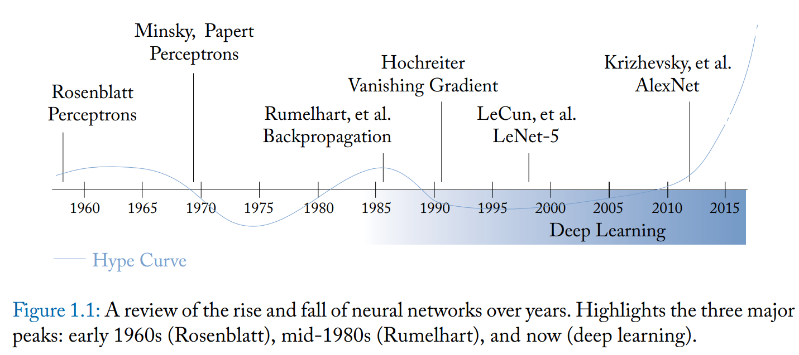

## 1.2 the third wave 
### 1.2.1 a virtuous cycle.
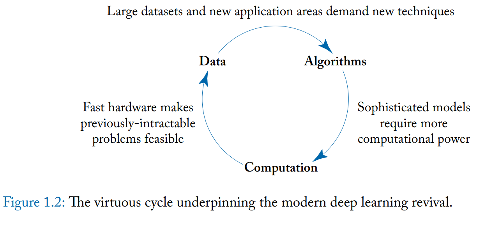

## 1.3 the role of hardware in deep learning
### 1.3.1 state of the practice
- MNIST : a commonly used research dataset, 
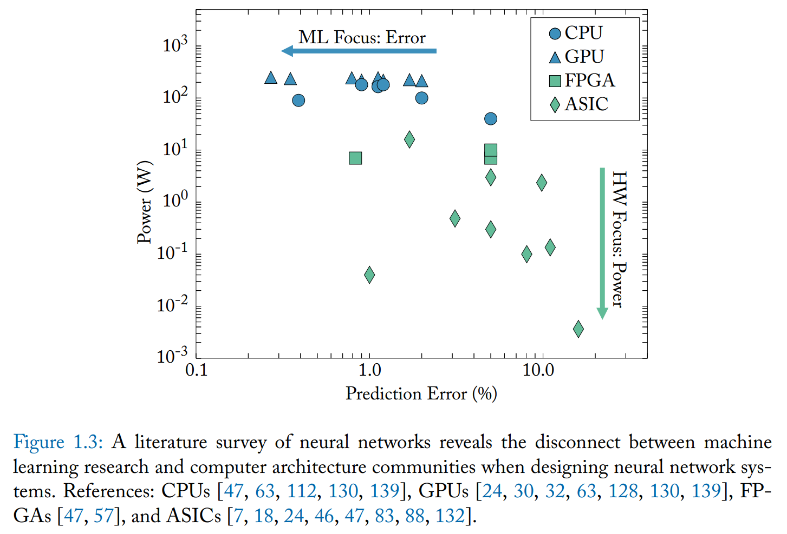

---

# 2 Foundations of Deep Learning
> review basics of neural networks from linear regression to perceptrons and up to today's state-of-the-art deep neural networks    

## 2.1 Neural Networks
### 2.1.1 biological neural networks

### 2.1.2 Artificial neural networks
two categories of neurons research:
- models that replicate biological neurons to explain or understand their behavior (domain of biologist and cognitive scientists)
- solve arbitrary problems using neuron-inspired models of computation.(***neuromorphic computing***)

**preceptron** -- one of the earliest and still most widely used model of single artificial neuron: 
 
  $$y=\varphi(\sum_{i}^{}(w_i*x_i))$$

  $\varphi$: nonlinear **activation function**. vestiges to bilogical, loosely models the activation threshold of voltage-gated membrane proteins.
  $\sum_{i}^{}(w_i,x_i)$: a weighted sum of input $x_i$. vestiges to biological, reflects charge accumulation in the soma

 

**Neural Network Principle**: the ability of a neural net to model complex behavior is not due to sophisticated neurons, but to the aggregate behavior of many simple parts

**multilayer perceptron (MLP)** simplest neural network
  - *layer* (as the input to a neural network are often referred to as the "input layer", but it is not counted toward the overall *depth*)
  - *depth*: number of layer
  - *width*: number of neurons in a given layer.
  - *n*th layer of an MLP can be expressed as :    

  $$X_{n,i} = \varphi(\sum_{j}^{}(W_{n,i,j} * X_{n-1,j}))$$  
  
  or vector notation: 

  $$X_n = \varphi(W_n * X_{n-1})$$

  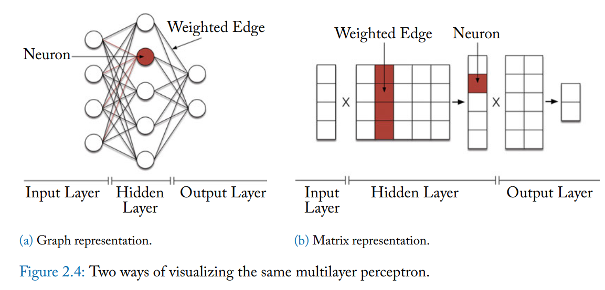

**Activation Function**($\varphi$) 
a few nonlinear activation functions (historically):  
  - step-function, surperseded by continuous like: 
  - sigmoid
  - hyperbolic tangent
  - **Rectified Linear Unit (ReLU)**, modern neural nets tend to use.
    Definition of Widely used ReLU function is just the positive component of its input :    
  > why is it required?
  > why nonlinear? a well-known identity: composing any number of linear transformations produces another linear transformation. 
  >> i.e.: if $\varphi(x) = x$,    
  >> $x_1 = w_1*x_0$    
  >> $x_2 = w_2*x_1$    
  >> then we get $x_2 = w_2 * (w_1 * x_0)$    
  >> which also means: $x_2 = w' * x_0$    
  > it implies that without nonlinear activation function $\varphi$, a neural network of any depth is identical to some single-layer network.  

widely used ReLU function is just hte positive component of its input:
$$ReLU(x) = (x > 0) ? x : 0;$$

### 2.1.3 Deep Neural Networks (DNN)
Complexity fix: lower depth, needs wider width 
> expressing complicated functions (especially high dimensions) is prohibitively expensive for a two-layer MLP -- The hidden layer needs far too many neurons.

Instead, turn to networks with multiple narrower layers: DNN.
DNN's attractive in principle: 
*when solving a complicated problem, it is easier to break it into smaller pieces and then build upon those results.*
Advantages:
1. which is easier and faster for humans.
2. these smaller intermediate solutions can often be reused within the same neural network.

## 2.2 Learning
- **learn** - we use the word *learn* to describe the process of using these rules to adjust the parameters of a generic model such that it optimizes some objective.

- *Heart of deep learning*: we are not using the occult to capture some abstract concept; we are adjusting model parameters based on quantifiable metrics.

### 2.2.1 Types of Learning
- **supervised learning** (we have a set of matching inputs and outputs for some process or function and our goal is to predict the output of future inputs) which including two steps:
  - training phase: $x,y \rightarrow M$
  - inference phase: $M(x') \rightarrow y'$
- **unsupervised learning** (without sample output)
  - training phase: $x \rightarrow M$
  - inference phase: $M(x') \rightarrow y'$
  e.g. 1) clustering; 2)outlier detection
    (*generative models*)
- **reinforcement learning** (related to supervised learning, but decouples the form of the training output from that of the inference output.)
  - action: output of a reinforcement learning
  - reward: each training's input.
  - training phase: $x,r \rightarrow M$
  - inference phase: $M(x') \rightarrow y'$

###2.3.2 How Deep Neural Network Learn
basic structure and characteristics: number of layers, size of layers and *activation function* are fixed; the values for neuron weight, by contrast, changed based on the data.

- **Loss functions**: one of the key design elements in training a neural network is what function we use to evaluate the *difference between the true and estimated outputs.* 
  - goal here is to find a function that will be minimized when the two are equal.
      - L1 norm of the difference: $L(y, y')=|y - y'|$
      - L2 norm, also know as: ***Root Mean Squared Error(RMSE)*** $L(y,y')=(y-y')^2$

  - cross-entropy loss:
    $$L(y,y') = -\frac{1}{n}\sum_{i}^{}ln(\frac{e^{y_i}}{\sum_{j}^{}e^{y'_j}})$$
    cross-entropy tends to be more effective for classification problems.

- **Optimization**: we want a way of adjusting the model weights to minimize our loss function.
  - *Stochastic Gradient Descent(SGD)*: *tells the direction in which to shift the estimate y'*
  - *Backpropagation*: *how to update the neural network to realize that shift(determiend by SGD)* the intuition behind backpropagation is that elements of a neural network should be adjust proportionally to the degree to which they contributed to generating the original output estimate.

  > Deep Neural Network depend on backpropagation for learning.

  gradient $\nabla{L(y,y')}$ is computing partial derivatives $\frac{\partial{L}}{\partial{x_i}}$ for all input $x$; for adjust individual weights: $\frac{\partial{L}}{\partial{w_{i,j}}}$, (every weight $j$, in every layer $i$) backpropagation is a mechanism for computing all of these partial loss components for every weight in a single pass.

  the DNN is *fully differentiable*, so the chain rule states that for multiple functions $f$, $g$, and $h$:
  $$\frac{\partial}{\partial{x}}f(g(h(x))) = \frac{\partial{f}}{\partial{g}} \frac{\partial{g}}{\partial{h}} \frac{\partial{h}}{\partial{x}}$$

  - *Cross-Entropy Loss math understanding:*
  <b>TODO</b>

 

- **Vanishing and Exploding Gradients**

---

# 3. Methods and Models
> dive into tools, workloads, and characterization. overview of modern neural network and machine learning software packages (TensorFlow, Torch, Keras, Theano and Caffe)

> present a collection of commonly used, seminal workloads that have assembled in a benchmark suit - Fathom. which will be break down into two categories: dataset(MNIST) and model.

## 3.1 An overview of advanced neural network methods

Aim: cheaper to compute, easier to train, robust to noise.

### 3.1.1 Model Architectures
- **Convolution Neural Networks(CNN)** a CNN works by sliding a large number of small trainable filters across an image.
  - mathematically: the forward operation is described by convolving an small filter with a large input image(hence the name). The backward (training) operation involves, naturally, deconvolving the gradients using the filters in order to produce a new set of gradients for the preceding layer.
  - An alternate interpretation of a CNN is as a large MLP where many of the weights in a layer are tied together in a specific pattern. In training, when a gradient update is applied to one of these weights, it is applied to all of them. These tied (or shared) weights correspond to a convolutional filter, and the structure with which they are connected describes the shape of the filter. In this interpretation, the computation of a CNN can be thought of as a compact representation of a larger MLP with identical mathematical properties

  AlexNet(2012)
  inception networks(2014.Google)
  Residual networks(2015.Microsoft)   

   

- **Recurrent Neural Networks(RNN)** 
  suit with *input dependencies* such as speech and language. dependencies are relationships between inputs that change their meanings
   
  RNNs are designed to deal with the sequential dependencies that often arise in time-series inputs. A RNN is a simple idea with complicated reprecussions: neurons use output as inputs in some way. 

  *unidirectional recurrent nets*
  *bidirectional networks*

  - Challenges when use RNN
    - 1. not easy to handle long-range dependencies.
    - 2. because of the inputs and outputs loopback the normal backpropagation algorithm no longer works.

    the first challenge motivated to develop a variety of recurrent neurons, the most popular one is *long-short-term memory* (LSTM)
 
    LSTM neurons have separate set of connections that propagate a signal to themselves and a set of "gates" that allow new values to be set or cleared from these connections. this act as a form of memory.
 
    LSTM are much more effective at capturing long-range dependencies.  
 
    *gated recurrent unit* a simplified version of LSTM has also proven popular.
   

- **Other Model Architectures**
  - bipyramidal encoder/decoder model, which stacks two neural networks back to back.
  e.g.: autoencoder

  - read/write networks

### 3.1.2 Specialized layers
Modern Neural Networks utilize a variety of algorithmic tricks beyond perceptrons. **Most of** these tricks are described as layers, even though they may or may not contain anything that is trainable.  

 
Most popular non-neuron layers

- Poolinig: simply aggregate the outputs of neurons from one layer. the operation itself is usually very simple: a max/min or mean of several values.
- Normalization: Normalization layers jointly transform the outputs of many neurons to conform to some constraint. typically, this is implemented as stretching  or shifting some or all of the outputs in a layer, and it is used to keep values within a similar range
*local response normalization*
*batch normalization* sof
## 3.2 Reference workloads for modern deep learning
### 3.2.1 Criteria For a Deep Learning Workload Suite
- Choose Meaningful Models: 
- Faithfully reproduce the original work: -- Fathom
- Leverage a Modern Deep Learning Framework.(High-Level programming model)
  - Torch
  - TensorFlow
  - Theano
  - Caffe

### 3.2.2 The Fathom workloads
**Fathom**, a collection of eight archetypal deep learning workloads
1. Sequence-to-Sequence translation
2. End-to-End memory networks
3. Deep Speech
4. Variational Autoencoder
5. Residual Networks
6. VGG-19
7. AlexNet
8. Deep Reinforcement learning

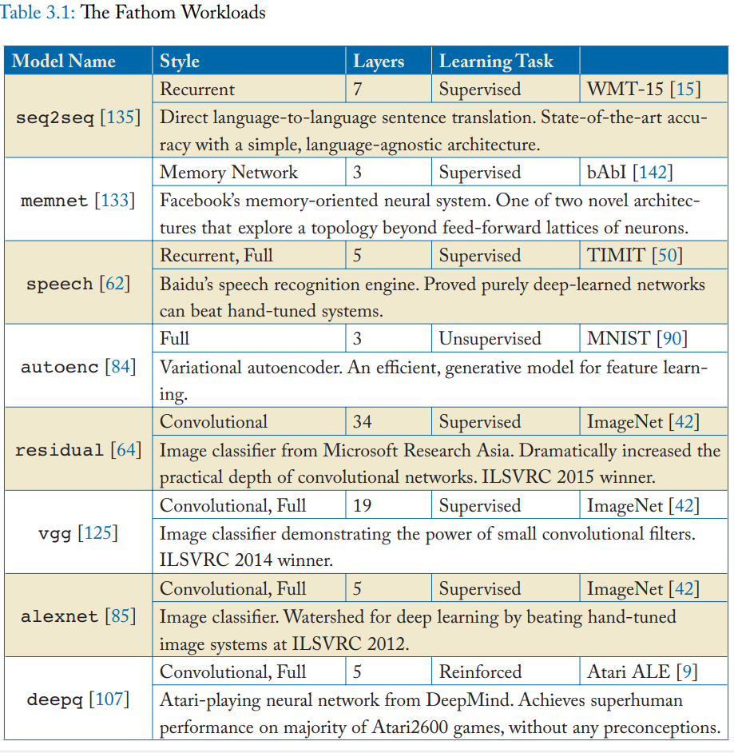

## 3.3 Computational intuition behind deep learning
### 3.3.1 Measurement and analysis in a deep learning framework.
high-level framework, easier to develop but hard to measure performance, have some degree of built-in tracing support. for TensorFlow framework, *operation* is the smallest schedulable unit in its runtime. 

Decomposing models into component operations is convenient for performance measurement. two main reasons:
1. operations tend to have stable repeatable behavior across the life of program. (*minibatches*a update-step boundaries of a program, composed by several operations?) sampling the execution time of operations across many steps allows us to quantify stability.
2. most deep learning models are dominated by the time spent inside their operations.

### 3.3.2 Operation type profiling
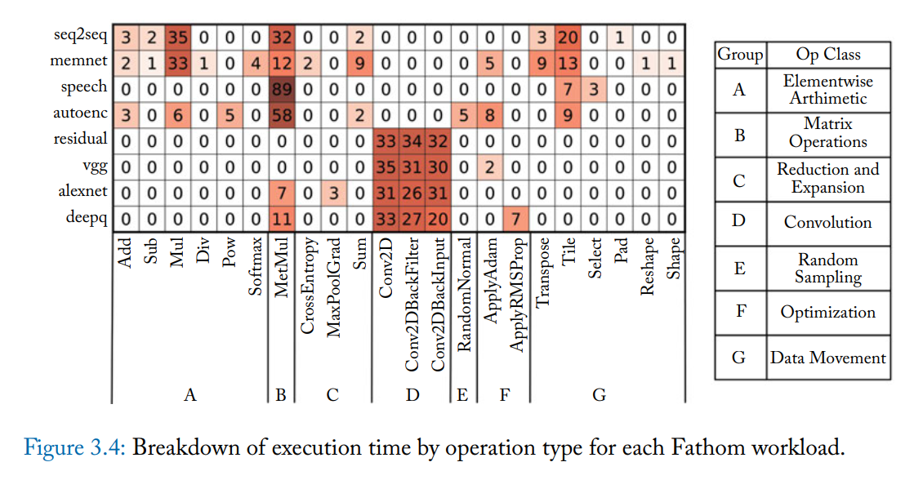
### 3.3.3 Performance similarity
Operation type profiling also offers a means of assessing similarity between workloads.
pairwise similarity can be computed using *cosine similarity* and we use the inverse form $1-\frac{A.B}{|A||B|}$ as distance metrics.
### 3.3.4 Training and inference
Vast majority of deep learning systems use some variant of *gradient descent* and *backpropagation* which can be seen as two distinct phases:
1. forward phase: model function compute an output from a given input. model's parameters are fixed.
2. backward phase: (update phase): **system evaluates its output on some criteria(a loss function). then for every learnable parameter in the model, system computes the partial derivative of the loss function with respect to that parameter. This gradient is use dto adjust the model parameters to minimize the value of the loss function.**

*Training a model requires evaluating both the forward and backward phases.*
*inference requires only the prior*

Most functions evaluated in the forward phase have an analogue in the backward phase with similar performance characteristics.

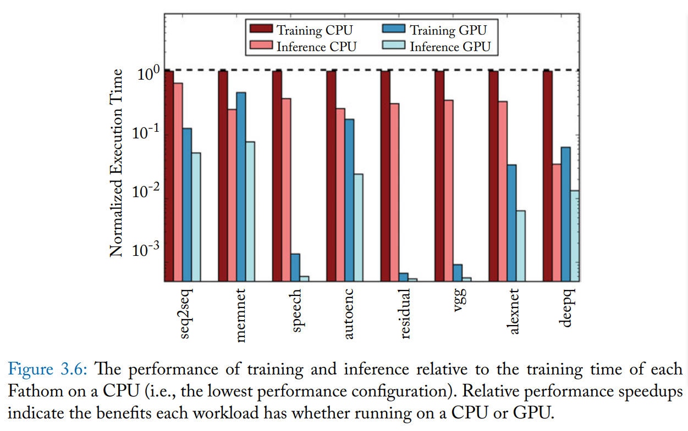

### 3.3.5 Parallelism and operation balance
Gene Amdahl's Law: for a fixed overall problem size

1) $$Speedup = T_{beforeOpt}/T_{afterOpt}$$
2) $$T_{afterOpt} = T_{beforeOpt}*(S + \frac{1}{N}*(1-S))$$

S: serial part ratio
1-S: parallel part ratio

call 2) in the 1) $$Speedup = \frac{1}{S+\frac{1}{N}*(1-S)}$$

the effect of Amdahl's law at the application level: *The benefits of parallelizing matrix multiplication and convolution are limited by smaller, data-dependent operations in other parts of some models*

The performance behavior of deep learning models is inextricably tied to their application-level structure. including convolution and matrix multiplication non-convolutional layers sophisticated loss functions or optimization algorithms or sparse storages.

---

# 4. Neural Network Accelerator Optimization: A Case Study
> Build off of Chapter3. review the Minerva accelerator design and optimization framework. include details of " how high-level neural network software libraries can be used in conglomeration with hardware CAD and simulation flows to co-design the algorithms and hardware.

- Minerva: 
  - algorithm (software level) 
  - architecture (architecture level)
  - circuit

- Minerva cross-layer optimization steps to baseline design
  - fine-grain, heterogeneous data-type quantization
  - dynamic operation pruning
  - algorithm-aware fault mitigation for low-voltage SRAM operation.

## 4.1 Neural networks and the simplicity wall
two prototypical neuron types: full connected and convolutional. in both styles the "loop trip-counts" are statically defined and govern all control flow and memory access patterns, which means very few resources are needed for control and little to no speculation is required to achieve high performance.

- simplicity wall: 
Major time is spent on executing matrix-multiplication and convolutions,for DLA arch. more research required to understand how to best *fine-tune* architectures to **manage data movement and memory systems**.

simplicity wall achieves once all *safe optimizations* have been applied
- save optimization:
one that can be applied without restraint to improve hardware efficiency without compromising the model's or more generally the workload's accuracy.

to overcome *simplicity wall* -- unsafe optimization (that alter the definition of the neural network model)
e.g. approximate computation. (algorithmic approximations ca result in substantial energy saving)
### 4.1.1 Beyond the wall: bounding unsafe optimizations.
difference between unsafe optimization and approximate computing. (all unsafe optimization can be used as approximate computing)

how to distinct an optimization is safe or unsafe:
APPROXIMATION EXceeding metric said to be approximate as the hardware improvement come at the expense of model accuracy; conversely, as long as the optimization's impact is below the threshold, it is still considered *unsafe*, but not *approximate* 

a distinction is made as to whether or not the optimization has a *notable* impact on the output. define a metric to quantify as "notable", this metrics called : **Iso-Training Noise (ITN)**, it is a computable score that quantifies how well an approximated model performs relative to the algorithmically correct one.

## 4.2 Minerva: a three-pronged approach
Design Steps:
- first. require a way to train models and manipulate them to understand the impact various fix point types have on accuracy. 
Software level:Keras;
*If a user wishes to add an unsafe optimization, it needs to be implemented in the software model*
- Second. need a means of quickly studying the power, performance and area trade-offs of the various design options.
Architectural level:Aladdin;
- Third. need a way to characterize hardware components such that they can be use in higher level models.
Circuit Level: EDA (silicon process/low power lib)
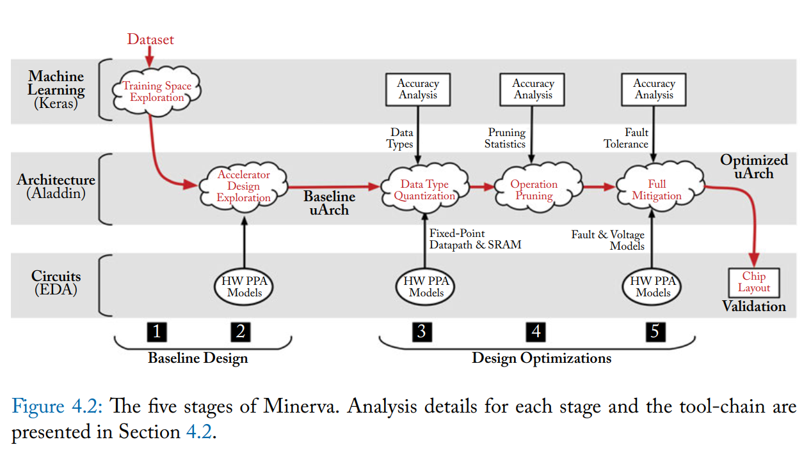

## 4.3 establishing a baseline: Safe Optimizations.
> first two stages in Minerva
### 4.3.1 Training Space exploration
to search the training space, and bring training into the hardware design loop, to be able to train for certain network properties intentionally offers more optimization opportunities. but more difficult to for human to reason about parameter settings and inter-parameter relationships.
e.g. the number of neurons per layer,
the datatypes to both maximize the model's accuracy and minimize its energy consumption.

- Hyperparameter space exploration.
  - number of hidden layers
  - number of nodes per layer
  - L1/L2 weight regularization penalties.
  - *dropout rate*
**Pareto frontier**: the resource distributed in the best optimized status. For a fixed people group, and resources set to be distributed, if we change the distribution rule from one to another, non of these people in the group getting worse than before, so at least one of them is getting better, this called *Pareto Frontier*
### 4.3.2 Accelerator design space
 for the selected and trained network from stage1 searches the accelerator microarchitectural design for high-performance designs.

 Minerva uses Aladdin and ultimately yields a power-performance Pareto frontier. Minerva reduces power by around an order of magnitude

 Use accelerator as a design base line(not CPU/GPU).
 Aladdin Arch:
 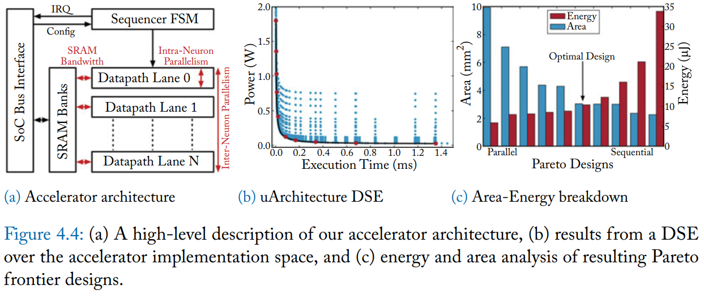

 *DSE* design space exploration.
the neural network kernel is embarrassingly parallel within a single layer, the bottleneck to performance- and energy-scaling quickly becomes memory bandwidth. to supply bandwidth, SRAM partitioned heavily into smaller banks. once the minimum SRAM design granularity is reached, additional partition becomes wasteful. (with heavy area penalty against excessively parallel designs and provides little significant energy improvement, as seen in the most parallel designs.)

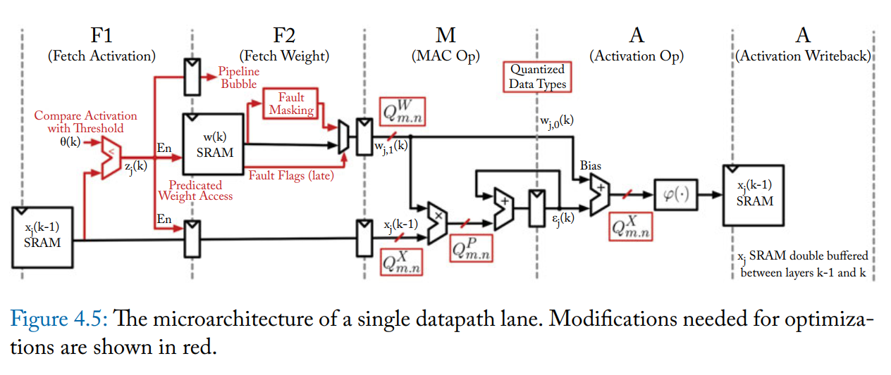
*the red wires and boxes denote additional logic needed to accommondate the minerva optimization*

- additional safe optimization tricks:
  - input batching for increased locality
  - different architectures (dataflow: *Eyeriss: An energyefficient reconfigurable accelerator for deep convolutional neural networks*)

## 4.4 Low-Power Neural networks accelerators: Unsafe Optimizations
### 4.4.1 Data Type Quantization
Stage3 of Minerva aggressively optimizes neural network bitwidths. the use of optimized data types is a key advantage that allows accelerators to achieve better computional efficiency than the general purpose programmable machines.

- Fixed-Point data type design
- Optimized Fixed-Point bitwidths
### 4.4.2 Selective Operation Pruning
Stage4 of Minerva reduce the number of edges that must be processed in the dataflow graph. using empirical analysis of neuron activity, show that by eliminating operations involving small activity values , the number of weight read and MAC operations can be drastically reduced without impacting prediction accuracy.

- Analysis of Neural network activations
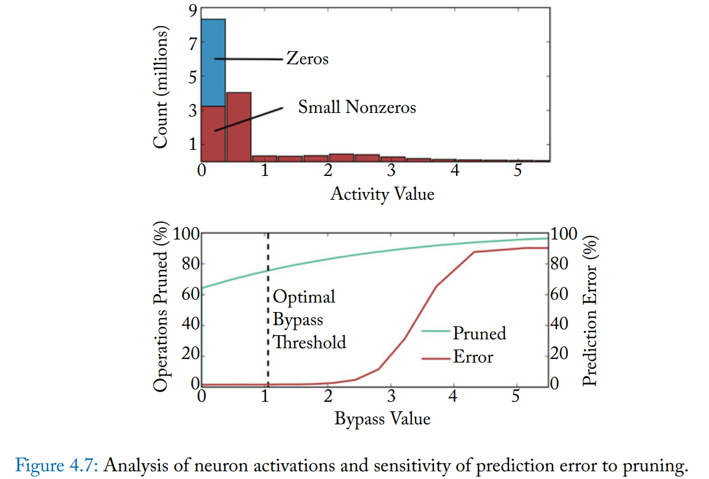

- Predicating on insignificant operations.

### 4.4.3 SRAM fault mitigation

## 4.5 Discussion
## 4.6 Looking forward.

# 5 A literature survey and review
> focus on the past decade and group papers based on the level in the compute stack (algorithmic, architecture, circuits) and by optimization type (sparsity, quantization, arithmetic approximation, and fault tolerance)
## 5.1 introduction
|abstraction   |algorithm|Architecture|Circuitt|
|:---          |:---     |:---        |:---    |
|dataType      | *       |   -        | -      |
|ModelSparsity | *       |   *        | -      |
|ModelSupport  | -       |   *        | -      |
|DataMovement  | -       |   *        | *      |
|FaultTolerance| -       |   -        | *      |

## 5.2 Algorithm
### 5.2.1 Data Type
### 5.2.2 Model Sparsity

# 6. Conclusion
> sheds light on areas that need attention and briefly outlines other areas of machine learning.