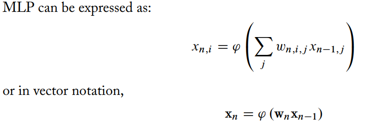

[toc]

# 1 Introduction
> define key vocabulary, recap history and evolution of the techniques, and make the case for additional hardware support in the field.

# 2 Foundations of Deep Learning

## 2.1 Neural Networks
### 2.1.1 biological neural networks

### 2.1.2 Artificial neural networks
- models that replicate biological neurons to explain or understand their behavior (domain of biologist and cognitive scientists)
- solve arbitrary problems using neuron-inspired models of computation.(***neuromorphic computing***)
  **preceptron** -- one of the earliest and still most widely used model.
  $y=phy(sum(wi*xi))$
  *phy*: nonlinear **activation function**
  *sum(wi,xi)*: a weighted sum of input *xi*
  - multilayer perceptron (MLP)
  - *layer* 
  - *depth*: number of layer
  - *width*: number of neurons in a given layer.

  
  
  - Nonlinear **activation function**(phy)
    - step-function
    - sigmoid
    - hyperbolic tangent
    - ***rectified linear unit** (ReLU)
      Definition of Widely used ReLU function is just the positive component of its input : $ReLU(x)=(x>0) ? x : 0;$

### 2.1.3 Deep Neural Networks

## 2.2 Learning
- learn - we use the word *learn* to describe the process of using these rules to adjust the parameters of a generic model such that it optimizes some objective.

- Heart of deep learning: we are not using the occult to capture some abstract concept; we are adjusting model parameters based on quantifiable metrics.

### 2.2.1 Types of Learning
- supervised learning
  - training
  - inference
- unsupervised learning
- reinforcement learning
  - action
  - reward

### 2.3.2 How Deep Neural Network Learn
- basic structure and characteristics: number of layers, size of layers and *activation function* are fixed; the values for neuron weight, by contrast, changed based on the data.

- **Loss functions**: one of the key design elements in training a neural network is what function we use to evaluate the difference between the true and estimated outputs.
  - goal here is to find a function that will be minimized when the two are equal.
      - L1 norm of the difference: $L(y, y')=|y - y'|$
      - L2 norm, also know as: ***Root Mean Squared Error(RMSE)*** $L(y,y')=(y-y')^2$

 - cross-entropy loss:
    $formula$
    cross-entropy tends to be more effective for classification problems.

- **Optimization**: we want a way of adjusting the model weights to minimize our loss function.
  - Stochastic Gradient Descent(SGD) *tells the direction in which to shift the estimate y'*
  - **Backpropagation**: *how to update the neural network to realize that shift(determiend by SGD)*

  ...
- **Vanishing and Exploding Gradients
